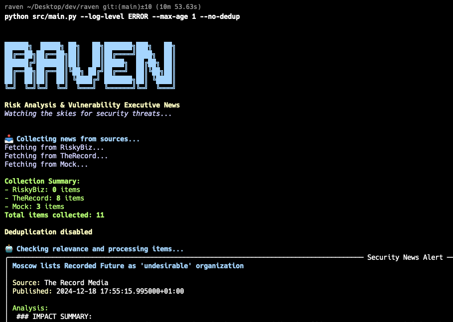

# 🦅 Raven

Raven is an intelligent security news aggregator designed to help organizations stay informed about relevant security threats and updates. It uses LLMs to analyze and filter security news based on your organization's tech stack, compliance requirements, and critical dependencies.



## Key Features

- **Multi-Source Collection**: Supports multiple news sources (Risky.biz, The Record Media)
- **Smart Filtering**: Uses LLMs to analyze news relevance based on your company profile
- **Deduplication**: Intelligent cross-source deduplication to avoid redundant news
- **Context-Aware**: Considers your tech stack, third-party dependencies, and compliance requirements
- **Modular Design**: Easy to extend with new collectors and output formats
- **Efficient Processing**: Two-stage LLM analysis to minimize resource usage
- **Time-Based Filtering**: Configurable age-based news filtering
- **Mock Data Support**: Built-in mock collector for testing and development

## Getting Started

### Prerequisites

- Python 3.12+
- [Ollama](https://ollama.ai/) with mistral-small model installed

### Installation

```bash
# Clone the repository
git clone https://github.com/marklechner/raven.git
cd raven

# Set up Python environment
python -m venv venv
source venv/bin/activate  # or `venv\Scripts\activate` on Windows

# Install dependencies
pip install -r requirements.txt

# Pull required Ollama model
ollama pull mistral-small
```

### Configuration

Create `config/config.yaml` based on the example:

```yaml
global:
  max_age_days: 7  # Default for all collectors

collectors:
  riskybiz:
    enabled: true
    feed_url: "https://risky.biz/feeds/risky-business/"
  therecord:
    enabled: true
  mock:
    enabled: false
    data_dir: "data/mock_news"

llm:
  model: "mistral-small"
  relevance_threshold: 0.6

company:
  name: "Your Company"
  industry: "Your Industry"
  size: "startup|enterprise|..."
  region: "EU|US|APAC|..."
  
  tech_stack:
    cloud: ["AWS", "GCP", "Azure"]
    languages: ["Python", "Java"]
    frameworks: ["Flask", "React"]
    infrastructure: ["Kubernetes", "GitHub"]
    
  security_concerns:
    high_priority: ["Cloud Security", "API Security"]
    compliance: ["SOC 2", "GDPR"]
    3rd_party_providers: ["Provider1", "Provider2"]
    
  assets:
    critical_systems: ["System1", "System2"]
```

### Usage

```bash
# Basic usage
python -m src.main

# Available commands:
python -m src.main --help                      # Show help
python -m src.main --check-config              # Validate config
python -m src.main --config custom-config.yaml  # Use custom config
python -m src.main --log-level DEBUG           # Set log level
python -m src.main --max-age 3                 # Override max age
python -m src.main --dry-run                   # Preview collection
python -m src.main --no-dedup                  # Disable deduplication
```

## Project Structure

```
raven/
├── config/               # Configuration files
│   ├── config.yaml
│   └── config.yaml.example
├── data/
│   └── mock_news/       # Mock news for testing
├── src/
│   ├── collectors/      # News source collectors
│   │   ├── base_collector.py
│   │   ├── riskybiz_collector.py
│   │   ├── record_collector.py
│   │   └── mock_collector.py
│   ├── processors/      # Processing logic
│   │   ├── llm_processor.py
│   │   └── deduplication_processor.py
│   ├── delivery/        # Output formatting
│   ├── models/          # Data models
│   ├── utils/           # Utility functions
│   └── main.py
└── tests/               # Test suite
```

## Adding New Features

### Implementing a New Collector

1. Create a new collector class in `src/collectors/`:

```python
from collectors.base_collector import BaseCollector
from models.news_item import NewsItem
from typing import List

class MyNewCollector(BaseCollector):
    def __init__(self, config: dict):
        super().__init__(config)
        # Initialize collector-specific settings

    async def collect(self) -> List[NewsItem]:
        # Implement collection logic
        pass
```

### Testing with Mock Data

1. Create YAML files in `data/mock_news/`:

```yaml
- title: "Test Security Event"
  content: "Detailed description of the security event..."
  published_date: "2024-12-19T10:00:00"
  categories: ["category1", "category2"]
```

2. Enable mock collector in config:

```yaml
collectors:
  mock:
    enabled: true
    data_dir: "data/mock_news"
```

## Development Guidelines

- Use type hints for better code clarity
- Add logging for important operations
- Follow the existing modular architecture
- Write tests for new features
- Update documentation as needed
- Use mock collector for testing new features
- Validate configurations using the built-in validator

## Future Improvements

- [ ] Additional news sources (X, Mastodon, etc.)
- [ ] Markdown, Slack, JIRA and Email delivery mechanisms
- [ ] Alternative (non-local/non-ollamaLLM backends)
- [ ] Advanced filtering options
- [ ] Web interface
- [ ] Alert system for critical news
- [ ] Historical data analysis
- [ ] Automated vulnerability correlation
- [ ] Enhanced third-party risk analysis
- [ ] Export capabilities
- [ ] Parallel processing for collectors

## License

This project is licensed under the MIT License - see the LICENSE file for details.
